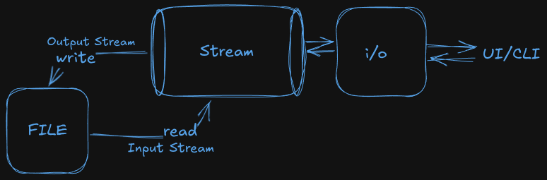
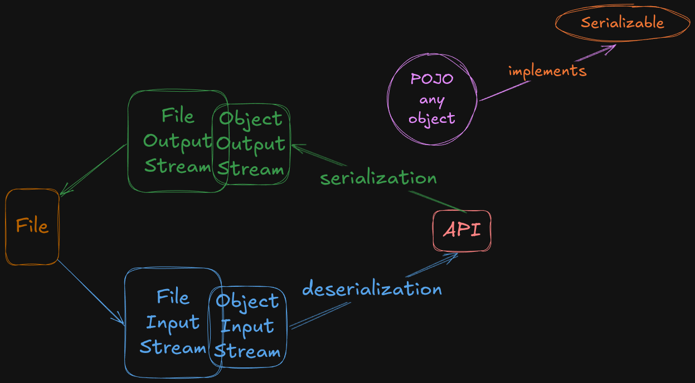
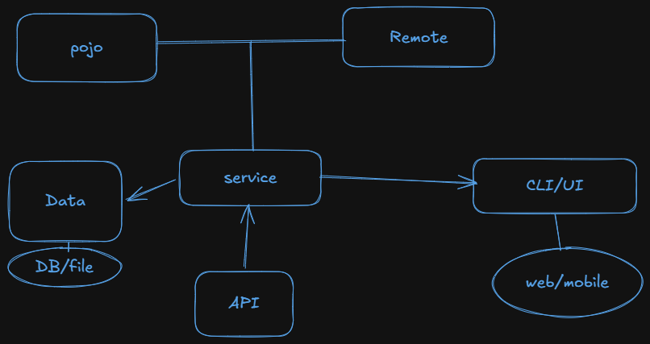
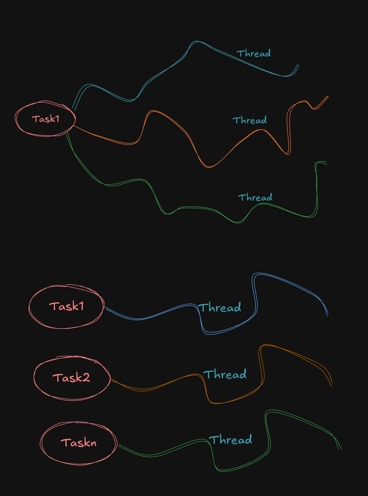

- [Google Classroom Link](https://classroom.google.com/c/ODYzMTkwNDMzNTM3)
- [Sirs GitHub](https://github.com/razzaksr/Nitte-PST-DSA-2026/)

## Placement LeetCode Solve

### DAY 1 - 29/05

- [X] [Move Zeroes](https://leetcode.com/problems/move-zeroes/)
- [X] [Sort Colors](https://leetcode.com/problems/sort-colors/)
- [X] [Missing Number](https://leetcode.com/problems/missing-number/)
- [ ] [Best Time to Buy and Sell Stock](https://leetcode.com/problems/best-time-to-buy-and-sell-stock/)
- [ ] [Remove Duplicates from Sorted Array](https://leetcode.com/problems/remove-duplicates-from-sorted-array)
- [ ] [Third Maximum Number](https://leetcode.com/problems/third-maximum-number)
- [ ] [Find Pivot Index](https://leetcode.com/problems/find-pivot-index)

### DAY 2 - 30/05

##### Find local LeetCode applications

- [ ] REGEX Matching name adhar pan password email
- [ ] [Group Anagrams](https://leetcode.com/problems/group-anagrams/)
- [ ] [Maximum Subarray (Kadane's algorithm)](https://leetcode.com/problems/maximum-subarray/)
- [ ] [Rotate Image](https://leetcode.com/problems/rotate-image/)
- [ ] [Set Matrix Zeroes](https://leetcode.com/problems/set-matrix-zeroes/)
- [ ] [Valid Palindrome](https://leetcode.com/problems/valid-palindrome/)

### DAY3

- [X] BMI
- [ ] Medium articles post it in linkedin
- [X] [Climbing Stairs](https://leetcode.com/problems/climbing-stairs/)
- [X] Patterns
- [X] [Rotate Array](https://leetcode.com/problems/rotate-array/)
- [X] [Power of Three](https://leetcode.com/problems/power-of-three/)
- [X] [Reverse Bits](https://leetcode.com/problems/reverse-bits/)
- [X] [Single Number](https://leetcode.com/problems/single-number/)

### DAY4

- [X] Using recursion find prefix and postfix sum
- [X] [Merge Sorted Array](https://leetcode.com/problems/merge-sorted-array/)
- [X] [Find Minimum in Rotated Sorted Array](https://leetcode.com/problems/find-minimum-in-rotated-sorted-array/)
- [X] Inheritance
- [X] [Fair Candy Swap](https://leetcode.com/problems/fair-candy-swap/)
- [X] [Search Insert Position](https://leetcode.com/problems/search-insert-position/)
- [X] Loan class objects

### DAY5

- [X] [Coin Change](https://leetcode.com/problems/coin-change/)
- [X] [Non-overlapping Intervals](https://leetcode.com/problems/non-overlapping-intervals/)
- [ ] Modifiers: public, static, private, default, final, abstract, protected
- [X] Loggings: java.util.Logger there are levels: INFO, DEBUG, ERROR, WARN

- { } Factory Pattern : List<>=new ArrayList<>
- { } Singleton pattern : only one object uses getter for that one object
- { } Exception Handling:
  Throwable>>interface
  Exception implements Throwable
  RunTimeException extends Exception

  Exceptions:
  Compile/Checked
  IOException
  InterruptedException
  Runtime/Unchecked
  ArrayIndexOutOfBoundsException
  NumberFormatException
  InputMismatchException
  Exception Handling:
  try{}
  catch(Exception e){}
  finally{}
  user defined exceptions

- [X] Run app
- [X] [House Robber](https://leetcode.com/problems/house-robber/)
- [X] IPv4 Validator
- [ ] [Meeting Rooms](https://leetcode.com/problems/meeting-rooms/) *(LintCode/Premium)*

### DAY6

- [X] [Longest Increasing Subsequence](https://leetcode.com/problems/longest-increasing-subsequence/)
- [X] [Unique Paths](https://leetcode.com/problems/unique-paths/) *
- [ ] [Longest Common Subsequence](https://leetcode.com/problems/longest-common-subsequence/)
- [X] Collections
- [X] [Largest Rectangle in Histogram](https://leetcode.com/problems/largest-rectangle-in-histogram/)
- [X] [LRU Cache](https://leetcode.com/problems/lru-cache/) *
- [X] [Sliding Window Maximum](https://leetcode.com/problems/sliding-window-maximum/)
- [ ] [Valid Parentheses](https://leetcode.com/problems/valid-parentheses/)
- [ ] [Daily Temperatures](https://leetcode.com/problems/daily-temperatures/)

### DAY7

- [X] [Unique Morse Code Words](https://leetcode.com/problems/unique-morse-code-words/)
- [X] [Jewels and Stones](https://leetcode.com/problems/jewels-and-stones/)
- [ ] [Longest Substring Without Repeating Characters](https://leetcode.com/problems/longest-substring-without-repeating-characters/)
- [X] [Minimum Window Substring](https://leetcode.com/problems/minimum-window-substring/)
- [X] [Top K Frequent Elements](https://leetcode.com/problems/top-k-frequent-elements/)
- [X] [Majority Element](https://leetcode.com/problems/majority-element/)
- [X] [Word Pattern](https://leetcode.com/problems/word-pattern/)

### DAY8

- [ ] File read and write to file
  BufferReader -> Data Input Stream / File Reader
  BufferWriter -> Data Output Stream / File Writer
  
- [ ] Serialization
  serialize >> ObjectOutputStream
  deserialize >> ObjectInputStream
  
- [ ] Threads

  - singletask multithread
  - multitask multithread
    
  - Multithread:

    - Multiple access/thread to the resource class
    - Resource class:class must inherit either ThreadClass/Runnable interface

    `public void run run();`

    ### Thread life cycle:

    - created/born
    - execute: run/start
    - waiting: sleep/wait
    - abort: stop

    To use threads

    - implement Runnable interface
    - extends Thread class

### DAY9

- [ ] Lambda Expression
- [ ] Method Reference
- [ ] Functional interface
- [ ] Thread problem
- [ ] Find words containing character
- [ ] First Missing Positive

### DAY10

- [ ] Generics
- [ ] Ternary Search
- [ ] Generic Method Problem
- [ ] Quick Sort
- [ ] Immutable class
- [ ] Solid principlies

  - S-Single Responsibiity
  - O-Open/Close
    - Google class
    - yt extends g //follows
    - drive extends g //follows
    - playstore extends yt //follows
    - facebook extends g //followed
    - insta extends facebook //not
    - thread extends insta //not
  - L-Liskov substitution
    - List has add remove get
    - ArrayList -child
    - LinkedList -child
  - I-Interface segregation
    - Banking interface >> Deposit & Withdraw
    - File>> storage
    - ATM >> Withdraw //violated interface segregation
  D-Dependancy Inversion:
    - File>> storage
    - DataBase>> storage
    - CRUD>> storage object l
  Database
    - Tables
      - Columns
        - types:varchar,int,double,bigint,blob
        - index:primary key,unique,foreign,default,-  - auto increment
      - rows/records

    - CRUD SQL
      - language types:
        DDL: create, drop, alter
        database, table, user, sequence, views, procedures, triggers, functions
        DQL: fetch joins select
        DML: select,insert,update,delete
        DCL: grant, revoke, authorize operations on tables grant, revoke
        TCL: Transaction commit rollback
        

### DAY11
- [ ] Complete SQL
- [ ] JAVA PROJECT SETUP
      - tools: maven, gradle
      - maven prject structure 
      mvn clean
      mvn

### Schedule

| Length | Start |  End  |
| -------: | :-----: | :-----: |
|     2h | 09:00 | 11:00 |
|  1.25h | 11:15 | 12:30 |
|  1.75h | 13:15 | 15:00 |
|     1h | 15:15 | 16:15 |
